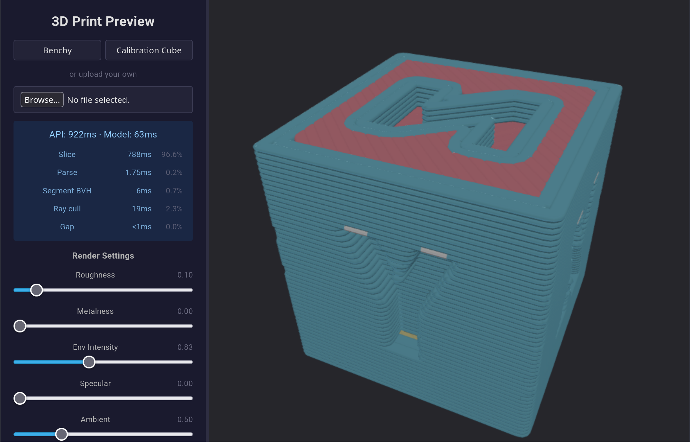

# 3D Print Preview Webapp

A real-time 3D print preview renderer that runs in the browser.

Takes in a 3D model, runs it through OrcaSlicer, and renders the sliced GCode in WebGL2.

An intermediate format `.segbin` is used to store the extrusion segments in a compact binary format for the frontend to load and render.



## Disclaimer

This was semi-vibe-coded with significant oversight.

That said, I'm not a graphics programmer nor a strong algorithms specialist so there's likely graphics, etc., code that could be improved more than I know how to.

## How it works

1. User uploads a 3D model (STL, OBJ, etc.) or selects a builtin model
2. The model is sent to the backend, which runs OrcaSlicer to generate GCode
3. A rust program parses the GCode, culls hidden segments, and outputs a `.segbin` file
4. The frontend loads the `.segbin` file and renders the extrusion segments

## Features

Server

- Runs OrcaSlicer to generate GCode from 3D models
- Uses a ray-based surface culling algorithm to remove hidden segments from the GCode to minimize size and frontend rendering effort
- Uses a custom binary format `.segbin` to store extrusion segments in a compact format

Frontend

- Vue 3 + Babylon.js WebGL2 renderer
- Uses instanced rendering to render thousands of extrusion segments
- 3-level level-of-detail (LOD) system to reduce rendering cost
- Tuneable material properties (color, roughness, metallic, etc.)

## Prerequisites

| Tool | Required for | Notes |
| ---- | ------------ | ----- |
| [OrcaSlicer](https://github.com/SoftFever/OrcaSlicer) | Slicing 3D models into GCode | Install any way you like (AppImage, package manager, [Nix](https://search.nixos.org/packages?query=orca-slicer), or build from source) |
| Rust toolchain | Building `gcode-to-segbin` CLI | `cargo` + `rustc` — install via [rustup](https://rustup.rs) |
| [Bun](https://bun.sh) | Running frontend and backend | Install via `curl -fsSL https://bun.sh/install \| bash` or your package manager |

## Quick start

### 1. Build the Rust pipeline

```bash
cd packages/gcode-to-segbin
cargo build --release
```

### 2. Frontend

```bash
cd packages/frontend
bun i
bun dev
```

### 3. Backend

```bash
cd packages/backend
bun i
bun dev

# or if Orca path detection fails:
ORCA_SLICER_BIN=/path/to/orca-slicer \
    ORCA_RESOURCES_DIR=/path/to/orca-slicer/resources \
    bun dev
```

The backend also auto-detects OrcaSlicer if it's on PATH or installed via Nix,
so the env vars above are only needed if auto-detection doesn't find it.

The backend attempts to find OrcaSlicer in this order:

1. `$ORCA_SLICER_BIN` environment variable
2. `orca-slicer` on PATH

And for the resources directory (printer/filament profiles):

1. `$ORCA_RESOURCES_DIR` environment variable
2. Auto-detected from the Nix store, or from common locations relative to the
   OrcaSlicer binary (bundled AppImage, system package, source build)

Note: For now, the backend is hardcoded to use the profile for an A1 Mini with 0.2mm layer height.

### 4. Start the frontend (separate terminal)

```bash
cd packages/frontend
bun dev
```

The frontend runs on `http://localhost:5173` and the backend on `http://localhost:3000`. In dev mode the backend proxies non-API requests to Vite's dev server automatically.

### Nix (recommended)

```bash
nix-shell
```

This provides Bun, Rust, and Node.js. You'll still need OrcaSlicer installed separately.

## Code layout

```text
packages/
├── frontend/           # Vue 3 + Babylon.js WebGL2 renderer
│   ├── src/
│   │   ├── renderer/   # GLSL shaders, geometry, segbin loader
│   │   ├── components/ # ModelViewer, App
│   │   └── __tests__/
│   └── public/         # Static assets (env maps)
├── backend/            # Express API for slicing pipeline and frontend proxy
└── gcode-to-segbin/    # Rust CLI: GCode → .segbin
    └── src/
        ├── parser.rs   # GCode state machine
        ├── arcs.rs     # Conic fillet subdivision at corners
        └── cull/       # Surface culling (contour / ray)
```

## Todo (Future wishlist)

- WebGPU renderer while using the WebGL2 as a fallback
- Temporal reprojection for the existing TAA
- Better LOD since large models can still end up with >20M triangles
- A way to get Deepseek v4 to stop trying to give up and revert its changes all the time

## Licenses

- **Code**: MIT (see [`LICENSE`](LICENSE))
- **Calibration cube model**: CC-BY 4.0 by DoomBro on [Printables](https://www.printables.com/model/32539-xyz-10mm-calibration-cube)
- **Environment map**: CC0 from [Poly Haven](https://polyhaven.com/a/horn-koppe_spring)
